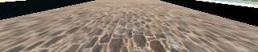

# **Behavioral Cloning** 

---
**Note: This project makes use of a Udacity-developed driving simulator and training data collected from the simulator (neither of which is included in this repo).**
**Behavioral Cloning Project**

---

### Introduction
The objective of this project is to teach the computer to drive car on on the basis of data collected in simulator provided by Udacity [here](https://github.com/udacity/self-driving-car-sim). Here we apply the concepts of Deep Learning and Convolutional Neural Networks to teach the computer to drive car autonomously.

We feed the data collected from Simulator to our model, this data is fed in the form of images captured by 3 dashboard cams center, left and right. The output data contains a file data.csv which has the mappings of center, left and right images and the corresponding steering angle, throttle, brake and speed. 

Using Keras Deep learning framework we can create a model.h5 file which we can test later on simulator with the command "python drive.py model.h5". This drive.py connects your model to simulator. The challenge in this project is to collect all sorts of training data so as to train the model to respond correctly in any type of situation.

---

---
### Files Submitted & Code Quality

#### 1. Submission includes all required files and can be used to run the simulator in autonomous mode

My project includes the following files:

* model.py containing the script to create and train the model
* drive.py for driving the car in autonomous mode
* model.h5 containing a trained convolution neural network 
* writeup_report.md or writeup_report.pdf summarizing the results

#### 2. Submission includes functional code
Using the Udacity provided simulator and my drive.py file, the car can be driven autonomously around the track by executing 
```sh
python drive.py model.h5
```

#### 3. Submitted code is usable and readable

The model.py file contains the code for training and saving the convolution neural network. The file shows the pipeline I used for training and validating the model, and it contains comments to explain how the code works.

### Model Architecture and Training Strategy

#### 1.  Model Overview

* I used the model provided by NVIDIA as suggested by Udacity. The model architecture is described by NVIDIA [here](https://images.nvidia.com/content/tegra/automotive/images/2016/solutions/pdf/end-to-end-dl-using-px.pdf). As an input this model takes in image of the shape (60,266,3) but our dashboard images/training images are of size (160,320,3). I decided to keep the architecture of the remaining model same but instead feed an image of different input shape which I will discuss later.


#### 2. Appropriate training data
* I did not use the the dataset provided by Udacity, I created fresh data using simulator by driving car for few laps covering multiple usecases.
* I am using OpenCV to load the images, by default the images are read by OpenCV in BGR format but we need to convert to RGB as in drive.py it is processed in RGB format.
* Since we have a steering angle associated with three images we introduce a correction factor for left and right images since the steering angle is captured by the center angle.
* I decided to introduce a correction factor of 0.2
* For the left images I increase the steering angle by 0.2 and for the right images I decrease the steering angle by 0.2
* Sample Images


#### 3. Solution Design Approach

* First step is to apply normalization to the all the images.
* Second step is to crop the image 70 pixels from top and 25 pixels from bottom. The image was cropped from top because I did not wanted to distract the model with trees and sky and 25 pixels from the bottom so as to remove the dashboard that is coming in the images.

Sample Input Image-
   

Cropped Image-



* Next Step is to define the first convolutional layer with filter depth as 24 and filter size as (5,5) with (2,2) stride followed by ELU activation function
* Moving on to the second convolutional layer with filter depth as 36 and filter size as (5,5) with (2,2) stride followed by ELU activation function 
* The third convolutional layer with filter depth as 48 and filter size as (5,5) with (2,2) stride followed by ELU activation function
* Next we define two convolutional layer with filter depth as 64 and filter size as (3,3) and (1,1) stride followed by ELU activation funciton
* Next step is to flatten the output from 2D to side by side
* Here we apply first fully connected layer with 100 outputs
* Here is the first time when we introduce Dropout with Dropout rate as 0.25 to combact overfitting
* Next we introduce second fully connected layer with 50 outputs
* Then comes a third connected layer with 10 outputs
* And finally the layer with one output.

Here we require one output just because this is a regression problem and we need to predict the steering angle.

#### 4. Final Model Architecture

The final model architecture (consisted of a convolution neural network with the following layers and layer sizes ...

  

#### 5. Attempts to reduce overfitting in the model

After the full connected layer I have used a dropout so that the model generalizes on a track that it has not seen. I decided to keep the Dropoout rate as 0.25 to combat overfitting.

#### 6. Model parameter tuning

* No of epochs= 5
* Optimizer Used- Adam
* Learning Rate- Default 0.001
* Validation Data split- 0.15
* Generator batch size= 32
* Correction factor- 0.2
* Loss Function Used- MSE(Mean Squared Error as it is efficient for regression problem).

#### 7. Final Output

* Video from Simulator
[![Click here to watch it on youtube]](https://youtu.be/hDMhReYnk2E)
* Video from Mobile Camera
[![Click here to watch it on youtube]](https://youtu.be/fRfiJHxTc0A)

#### 8. Important Notes:

* I faced issue running simulator on my local GPU system. To solve the issue, I added below code to drive.py

from tensorflow.compat.v1 import ConfigProto
from tensorflow.compat.v1 import InteractiveSession

config = ConfigProto()
config.gpu_options.allow_growth = True
session = InteractiveSession(config=config)

* Also to save time while verifying result, I changed vehicle speed to 30mph in drive.py

